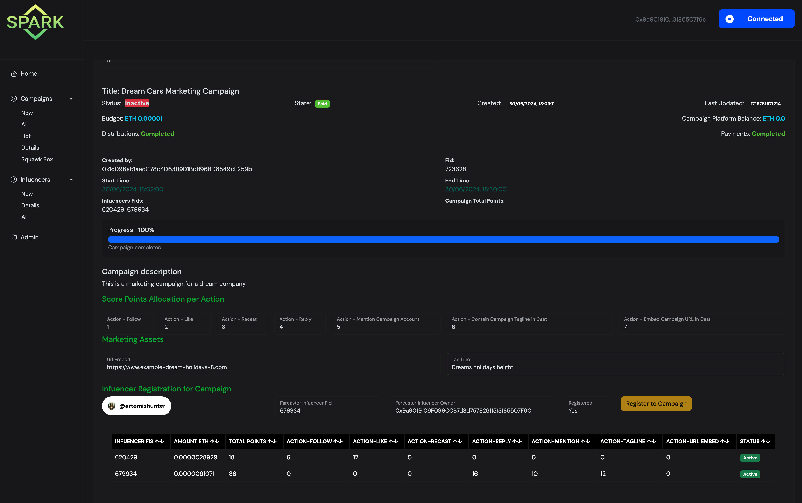
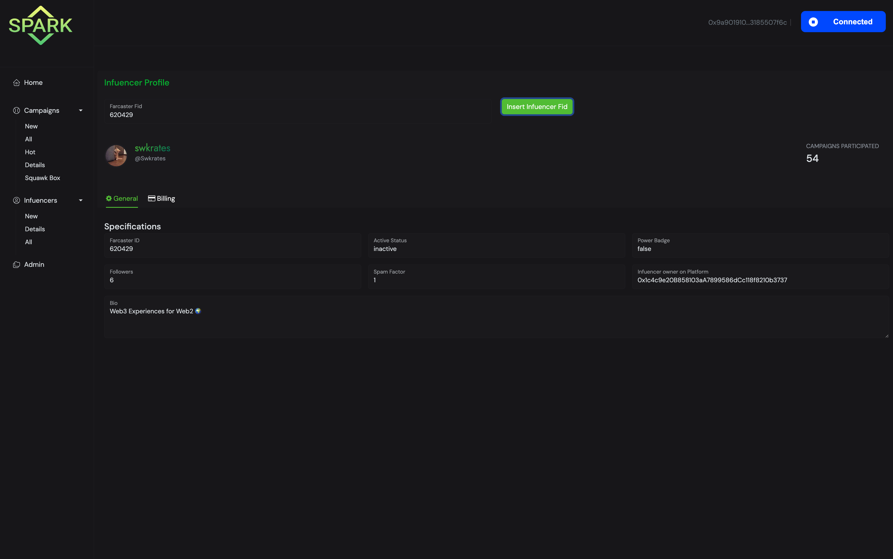

## Registering New Campaign

Visit /Campaigns/New Campaign

Fill

1. Title
2. Farcaster FID of Campaign owner (where all marketing material will be published)
3. Description
4. The Ethereum Address of the campaign this is by default the account signed in Smart Wallet
5. Budget - ETH you will transfer for this campaign
6. Start and End date
7. The points you want to allocate per infuencer action. This is subjective and depends on the Campaign Owner preference. For example if he/she considers re-casting more important than like then could allocate 2 points for recasting and 1 for likes
8. Some Marketing assets such as a url that can be emdeded in a cast for extra points e.g. company website or Frame url (for example look at frome https://frames.neynar.com/f/67b42b8d/69ae0817 here https://warpcast.com/~/developers/frames?url=https%3A%2F%2Fframes.neynar.com%2Ff%2F67b42b8d%2F69ae0817 or a Tag Line e.g. "Yolo holidays"

Click Cancel to start again or Create Campaign to submit the campaign

Note: When clicking "Create a Campaign" , the campaign is registred on the protocol. Soon after another transaction pops up that will register the necessary webhook data (besides our Neynar Webhooks), in our smart contracts so that our Webhooks server that feeds these smart contracts are in harmony one with another. These data are also needed for unregistering the webhook data from Neynar when the campaign completes.

> STAGE: A new campaign is subitted in the smart contract and is included in the Pending Campaigns

---

Keepers Server side

1. **checkPendingCampainStatus** to move a campaign from Pending to Active when it reaches startTime
2. **checkActiveCampainStatus** to move a campaign from Active to Expired when it reachea end time
3. **calculateDistributions** for each Expired Campaign to calculate weights of each infuencer based on his/her points so that we know how much funds they are eligible to receive
4. **checkExpiredCampainStatus** for Expired Campaigns when the previous step calculateDistributions is complete , move them to readyFroPaymentCampaignUIDs campaigns
5. **makePayments** for campaigns that are in readyFroPaymentCampaignUIDs
6. **checkReadyForPaymentStatus** to move campaign from Ready2Payment to Completed
   > When a campaign has paid funds then it will be of state Paid otherwise (if no points were scored) Void and the campaign owner can get his ETH back.

---

## addresses of Smart Contracts

Across all our repos there is a common file created in the HardHat repo called DeploymentData.json ( https://github.com/Entity54/OCS-SPARK-FE/blob/main/src/DeploymentData.json ) and holds the addresses our smart contracts are deployed on both Base and Sepolia

Our protocol has four smart contracts

### CampaignManager

Responsible for managing the lifeline of a campaign from registration and Pending to Active, calculating distributions, making payments and completing the campaign

### InfluencersManager

Responsible for managing the Infuencer side from registration of an Infuencer on the Protocol for the first time, Registering the Infuencer on a specific Campaign to storing the Infuencer details e.g. Fid and Verified Ethereum account

### CampaignAssets

Responsible for storing Campaign Emebed Urls (Website or Frame url), taglines and all relevant Webhook data that wll be used for filtration of incoming messages from the Webhook server

### SquawkProcessor

This is the point of contact of our Webhooks server.
Our Webhooks server is notified from Neynar when a specific farcaster action is performed. The Webhooks server analyses the action and calls the SquawkProcessor to register this in the Squawk Box.

The Keepers server is responsible to call "processSquawkData" to process existing unprocessed actions and award points to the relevant infuencers.

This Squawk Box registry is shown in the Squawk page of the website

---

### Demo Video - https://www.youtube.com/watch?v=T_FYEf3-lCs

In the provided demo video most tof the functionalities are explained

We used the Farcaster account @dreams-company to act as a company that wants to run a campaign and post a frame here https://warpcast.com/dreams-company/0xb2fb90f5 that asks campaign registered infuencers to react with

The Smart wallet account used is
`Company runs Campaign "0x1cd96ab1aecc78c4d63b9d1bd8968d6549cf259b Fid: 723628 `

Then we created two influencers with the details below to perform some actions like Follow, Like, Reacast, cast with embed etc.

```
Infuencer Swkrates "0x1c4c9e20b858103aa7899586dcc118f8210b3737" Fid: 620429
Infuencer Artemis "0x9a9019106f099ccb7d3d75782611513185507f6c" Fid: 679934
```

At the end of the campaign in the video we can see the calculated distributions and automatic payments sent to the Infuencers which we can also see here https://basescan.org/tx/0xcb3cd794373dfdcd7e8df2a750d34c1f0f698e73c2af9f77312a5791886de124

---

## Pritnscreens

### Campaigns

### New - Register a new campaign


### All - See present and past campaigns


### Hot - Pending to Start or Active Campaigns


### Campaign Details


### End of Cmapaign Paayments



### Sqauwk - See actions performed from Spark registere infuencers and across all campaigns


---

### Infuencers

### Register Infuencer on Spark



### All - See all infuencers registered in the Spark Protocol


### Details


---
